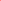
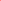
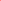

# Quasimodo RTX

Quasimodo RTX extends Quake II RTX with modernized tooling, RTX terrain, water, material/splat workflows, and launcher support.

## Terrain & Water



A large RTX terrain test scene with water integration, terrain BLAS/TLAS rendering, splat/material support, and optional terrain collision diagnostics.



Second terrain/water validation view showing the hybrid BSP + terrain workflow and runtime test environment.

**Quasimodo RTX** is a FutureRetro fork of Quake II RTX focused on keeping the classic Quake II identity while extending the engine with modern RTX rendering, terrain, water, HTML/CSS-driven UI, tooling, and experimental physics infrastructure.

This repository is still GPL/open-source engine work, but the direction is broader than a renderer fork: Quasimodo RTX is becoming a modding-friendly retro engine with RTX path tracing, terrain authoring, modern launcher workflows, and safer development tooling.

## Quasimodo Wizard



Quasimodo Wizard is the companion launcher and tooling app for Quasimodo RTX: launch `q2rtx.exe` with presets, tune common renderer and terrain cvars from a **Launch** tab, and keep the legacy map import / analyze / compile pipeline under **Map Wizard**. Run from the repository with `python tools/quasimodo_wizard/main.py` or `tools\quasimodo_wizard\run_quasimodo_wizard.bat` (see `tools/quasimodo_wizard/package_launcher.ps1` for optional one-file `launcher.exe` packaging).

## Latest Highlights

- **RTX terrain system**  
  Optional `.jungle` terrain loading, heightfield chunks, CPU LOD groundwork, static terrain BLAS/TLAS instancing, terrain debug commands, splatmap smoke assets, and opt-in terrain collision.

- **Terrain water**  
  Optional `.jungle` water plane support with path-traced visibility, water BLAS/TLAS integration, debug reporting, and safe `terrain_water 0` default behavior.

- **Terrain collision and diagnostics**  
  BSP + terrain hybrid collision is available behind cvars. JoltPhysics is integrated as an optional, default-off diagnostic backend for comparing terrain support behavior, while legacy gameplay collision remains authoritative.

- **HTML/CSS UI workflow**  
  RmlUi-based interface work enables a more modern UI authoring path using RML/CSS-style layouts instead of hardcoded menu screens.

- **Startup splash control**  
  The splash screen is now cvar-gated so profiling, direct `+map` launches, and automated test launches can skip it cleanly.

- **Quasimodo Wizard / Launcher workflow**  
  The **Quasimodo Wizard** app under `tools/quasimodo_wizard/` provides a **Launch** tab (presets, common cvars, command preview), **Map Wizard** (legacy analyze/convert/compile flow), and **Advanced** arbitrary `+set` rows. Optional PyInstaller packaging script targets a repo-root `launcher.exe`.

- **Modern RTX stack**  
  The engine includes ReSTIR DI, NRD, NVIDIA DLSS Super Resolution, and NVIDIA Reflex integration work.


## Build From Scratch (Windows, recommended)

### Prerequisites

Install these tools before building:

- **Git** (required)
- **Git LFS** (optional; no LFS patterns were detected in this repo, but install if your environment/policy requires it)
- **CMake** (repo uses CMake as the build system)
- **Visual Studio 2022** with **Desktop development with C++** (MSVC + MSBuild)
- **Windows SDK** (installed via Visual Studio workload)
- **Vulkan SDK** (must set `VULKAN_SDK`; build scripts check this)
- **PowerShell 5.1+** (required for repository build helper scripts)

### 1) Clone the repository (with submodules)

```bash
git clone --recursive https://github.com/cynicgamesofficial/Quasimodo-RTX.git
cd Quasimodo-RTX
```

If you already cloned without submodules:

```bash
git submodule update --init --recursive
```

### 2) Download third-party SDKs

This repository includes a root script: `download-thirdparties.ps1`.

Run it from repo root.

**PowerShell:**
```powershell
.\download-thirdparties.ps1
```

**Command Prompt (cmd.exe):**
```cmd
powershell -ExecutionPolicy Bypass -File .\download-thirdparties.ps1
```

Alternative via dispatcher script (same effect):
```powershell
.\dev.ps1 thirdparties
```

### 3) Generate build system files

After submodules and third-party downloads:

```powershell
.\dev.ps1 configure
```

What this does:
- Configures CMake in `build/`
- Uses generator: `Visual Studio 17 2022` + `x64`
- Uses `RelWithDebInfo` configuration by default
- Passes `NRD_ROOT` automatically if `Third Parties\NRD` exists

### 4) Build the project

**Default scripted build (RelWithDebInfo):**
```powershell
.\dev.ps1 build
```

**Rebuild from clean state (optional):**
```powershell
.\dev.ps1 rebuild
```

### 5) Build Debug / Release configurations (if needed)

The repo is configured with a Visual Studio multi-config generator, so you can build explicit configs with CMake:

```powershell
cmake --build build --config Debug --parallel
cmake --build build --config Release --parallel
```

(`.\dev.ps1 build` currently builds `RelWithDebInfo`.)

### 6) Optional helper commands

```powershell
.\dev.ps1 doctor      # checks tools/env/submodules/build readiness
.\dev.ps1 shaders     # builds shader target
.\dev.ps1 run         # runs q2rtx.exe
```

### Troubleshooting

#### Missing submodules

Symptoms: configure fails in `extern/*` dependencies.

Fix:
```bash
git submodule update --init --recursive
```

#### Third-party download failures

Symptoms: `download-thirdparties.ps1` errors during download/hash/extract.

Checks:
- Confirm internet access and GitHub availability.
- Re-run script from repo root:
  ```powershell
  .\download-thirdparties.ps1
  ```
- If your policy blocks script execution, run from cmd with:
  ```cmd
  powershell -ExecutionPolicy Bypass -File .\download-thirdparties.ps1
  ```

#### Git LFS issues

No root LFS tracking entries were detected, but if your clone expects LFS:
```bash
git lfs install
git lfs pull
```

#### CMake / generator problems

Symptoms: configure fails or wrong architecture/toolchain selected.

Fix:
- Ensure VS 2022 + C++ workload is installed.
- Re-run:
  ```powershell
  .\dev.ps1 configure
  ```
- Confirm `build/` was generated for **x64**.

#### Visual Studio / MSBuild toolchain issues

Symptoms: build fails with compiler/MSBuild not found.

Fix:
- Install/repair **Visual Studio 2022** with **Desktop development with C++**.
- Ensure Windows SDK is installed.
- Run readiness check:
  ```powershell
  .\dev.ps1 doctor
  ```

#### Vulkan SDK not detected

Symptoms: configure script reports `VULKAN_SDK` missing.

Fix:
- Install Vulkan SDK from LunarG.
- Ensure environment variable `VULKAN_SDK` points to a valid SDK path.
- Restart terminal and re-run:
  ```powershell
  .\dev.ps1 configure
  ```

## Engine Concept

Quasimodo RTX follows a FutureRetro engine concept: preserve classic Quake II gameplay identity on a GPL codebase while advancing modern engine/runtime capabilities.

Current long-term focus:

  - keep a stable and open GPL codebase for community collaboration
   - evolve modern rendering and latency features (including ReSTIR DI, NRD, DLSS, and Reflex)
  - improve portability, maintainability, and compatibility for long-term retro engine use
    
## Original README

**Quake II RTX** is NVIDIA's attempt at implementing a fully functional 
version of Id Software's 1997 hit game **Quake II** with RTX path-traced 
global illumination.

**Quake II RTX** builds upon the [Q2VKPT](http://brechpunkt.de/q2vkpt) 
branch of the Quake II open source engine. Q2VKPT was created by former 
NVIDIA intern Christoph Schied, a Ph.D. student at the Karlsruhe Institute 
of Technology in Germany.

Q2VKPT, in turn, builds upon [Q2PRO](https://github.com/skullernet/q2pro), which is a 
modernized version of the Quake II engine. Consequently, many of the settings 
and console variables that work for Q2PRO also work for Quake II RTX.

## License

**Quake II RTX** is licensed under the terms of the **GPL v.2** (GNU General Public License).
You can find the entire license in the [license.txt](license.txt) file.

The **Quake II** game data files remain copyrighted and licensed under the
original id Software terms, so you cannot redistribute the pak files from the
original game.

## Features

**Quake II RTX** introduces the following features:
  - Caustics approximation and coloring of light that passes through tinted glass
  - Cutting-edge denoising technology
  - Cylindrical projection mode
  - Dynamic lighting for items such as blinking lights, signs, switches, elevators and moving objects
  - Dynamic real-time "time of day" lighting
  - Flare gun and other high-detail weapons
  - High-quality screenshot mode
  - Multi-GPU (SLI) support
  - Multiplayer modes (deathmatch and cooperative)
  - Optional two-bounce indirect illumination
  - Particles, laser beams, and new explosion sprites
  - Physically based materials, including roughness, metallic, emissive, and normal maps
  - Player avatar (casting shadows, visible in reflections)
  - Recursive reflections and refractions on water and glass, mirror, and screen surfaces
  - Procedural environments (sky, mountains, clouds that react to lighting; also space)
  - Sunlight with direct and indirect illumination
  - Volumetric lighting (god-rays)

You can download functional builds of the game from [GitHub Releases](https://github.com/NVIDIA/Q2RTX/releases).

Latest development builds can be found in the [Actions](https://github.com/NVIDIA/Q2RTX/actions/workflows/build.yml) tab.
To run a development build, download the artifact, extract it and put `q2rtx_media.pkz`, `blue_noise.pkz` and the `pak*.pak` files from the original game into `baseq2/`.

## Additional Information

  * [Announcement Article](https://www.nvidia.com/en-us/geforce/news/quake-ii-rtx-ray-tracing-vulkan-vkray-geforce-rtx/)
  * [Ray-Tracing Deep Dive](https://www.nvidia.com/en-us/geforce/news/geforce-gtx-dxr-ray-tracing-available-now/)
  * [Launch Trailer Video](https://www.youtube.com/watch?v=unGtBbhaPeU)
  * [Path Tracer Overview Video](https://www.youtube.com/watch?v=BOltWXdV2XY)
  * [GDC 2019 Presentation](https://www.gdcvault.com/play/1026185/)
  * [Client Manual](doc/client.md)
  * [Server Manual](doc/server.md)

Also, some source files have comments that explain various parts of the renderer:

  * [asvgf.glsl](src/refresh/vkpt/shader/asvgf.glsl) explains the denoiser filters
  * [checkerboard_interleave.comp](src/refresh/vkpt/shader/checkerboard_interleave.comp) shows how checkerboarded rendering facilitates path tracing on multiple GPUs and helps with water and glass surfaces
  * [path_tracer.h](src/refresh/vkpt/shader/path_tracer.h) gives an overview of the path tracer
  * [tone_mapping_histogram.comp](src/refresh/vkpt/shader/tone_mapping_histogram.comp) explains the tone mapping solution 


## Support and Feedback

  * [GeForce.com Forums](https://forums.geforce.com/default/topic/1119082/geforce-rtx-20-series/quake-ii-rtx-installation-guide/)
  * [Steam Community Hub](https://steamcommunity.com/app/1089130)
  * [GitHub Issue Tracker](https://github.com/NVIDIA/Q2RTX/issues)

## System Requirements

In order to build **Quake II RTX** you will need the following software
installed on your computer (with at least the specified versions or more 
recent ones).

### Operating System

|             | Windows    | Linux                          |
|-------------|------------|--------------------------------|
| Min Version | Win 7 x64  | Ubuntu 16.04 x86_64 or aarch64 |

Note: only the Windows 10 version has been extensively tested.

Note: distributions that are binary compatible with Ubuntu 16.04 should work as well.

Note: Linux ppc64le is also known to work though not officially supported.

### Software

|                                                         | Min Version |
|---------------------------------------------------------|-------------|
| NVIDIA GPU driver <br> https://www.geforce.com/drivers  | 460.82      |
| AMD GPU driver <br> https://www.amd.com/en/support      | 21.1.1      |
| git <br> https://git-scm.com/downloads                  | 2.15        |
| CMake <br> https://cmake.org/download/                  | 3.8         |
| Vulkan SDK <br> https://www.lunarg.com/vulkan-sdk/      | 1.2.162     |

## Submodules

* [zlib](https://github.com/madler/zlib)
* [curl](https://github.com/curl/curl)
* [SDL2](https://github.com/spurious/SDL-mirror)
* [stb](https://github.com/nothings/stb)
* [tinyobjloader-c](https://github.com/syoyo/tinyobjloader-c)
* [Vulkan-Headers](https://github.com/KhronosGroup/Vulkan-Headers)
* [glslang](https://github.com/KhronosGroup/glslang) (optional, see the `CONFIG_BUILD_GLSLANG` CMake option)
* [openal-soft](https://github.com/kcat/openal-soft)

## Original Building Guide

### Clone and submodules

  1. Clone **with submodules** so `extern/` dependencies are populated:

     `git clone --recursive https://github.com/NVIDIA/Q2RTX.git`

     If you already cloned without submodules, fetch them from the repository root:

     `git submodule update --init --recursive`

     On Windows you can run the same step via the dev script: `.\dev.ps1 submodules` (see below).

### Windows: build with `dev.ps1` (recommended)

From the repository root in **PowerShell**, use the dispatcher `dev.ps1`. It runs scripts under `scripts/dev/`, keeps the build directory at **`build/`** (required for shader rules), configures **Visual Studio 2022** x64 **RelWithDebInfo**, and places the main game executable at **`q2rtx.exe`** in the repository root.

Prerequisites: **Visual Studio 2022** (C++ workload), **CMake**, **Vulkan SDK** installed with **`VULKAN_SDK`** set (the configure step checks this).

| Command | Description |
|---------|-------------|
| `.\dev.ps1 submodules` | Initialize or update Git submodules (`git submodule update --init --recursive`). |
| `.\dev.ps1 configure` | Run CMake configure (`-G "Visual Studio 17 2022" -A x64`, build tree `build/`). |
| `.\dev.ps1 build` | Build the project (parallel, RelWithDebInfo). |
| `.\dev.ps1 rebuild` | Clear `build/`, run configure, then build (full refresh). |
| `.\dev.ps1 clean` | Delete generated files inside `build/` (then run `configure` again before building). |
| `.\dev.ps1 clean-build` | Remove and reconfigure `build/` from scratch. |
| `.\dev.ps1 shaders` | Compile Vulkan shaders into `baseq2/shader_vkpt/*.spv`. |
| `.\dev.ps1 run` | Run `q2rtx.exe` with `+set vid_renderer vkpt` (build first). |
| `.\dev.ps1 doctor` | Print environment / toolchain checks. |

Typical first-time flow:

```
.\dev.ps1 configure
.\dev.ps1 build
```

Then either run `.\dev.ps1 run` or launch `q2rtx.exe` from the repo root.

### Linux and manual CMake (alternative)

Use this path if you are not using the Windows scripts, or you prefer the CMake GUI / a different generator.

  1. Ensure submodules are present (see above).

  2. Create a folder named **`build`** under the repository root. This location is required by the shader build rules.

  3. Configure from that folder:

     `cd build`  
     `cmake ..`

     **Note:** only **64-bit** builds are supported—pick a 64-bit generator when configuring.

     When CMake configures `curl`, warnings such as `Found no *nroff program` can be ignored.

  4. Build:

     `cmake --build . --parallel`

     On Windows without `dev.ps1`, use Visual Studio to open the generated solution, or the same `cmake --build` command from `build/`.

### Game assets (required to run, not to compile)

Copy (or symlink) data into **`baseq2/`** before expecting the game to start. The engine needs **`blue_noise.pkz`** and **`q2rtx_media.pkz`** (or their extracted contents), and the original **`pak*.pak`** files for Quake II content. Packages are available from [GitHub Releases](https://github.com/NVIDIA/Q2RTX/releases) or a published Quake II RTX install.

## Music Playback Support

Quake II RTX supports music playback from OGG files, if they can be located. To enable music playback, copy the CD tracks into a `music` folder either next to the executable, or inside the game directory, such as `baseq2/music`. The files should use one of these two naming schemes:
  - `music/02.ogg` for music copied directly from a game CD;
  - `music/Track02.ogg` for music from the version of Quake II downloaded from [GOG](https://www.gog.com/game/quake_ii_quad_damage).

In the game, music playback is enabled when console variable `ogg_enable` is set to 1. Music volume is controlled by console varaible `ogg_volume`. Playback controls, such as selecting the track or putting it on pause, are available through the `ogg` command.

Music playback support is using code adapted from the [Yamagi Quake 2](https://www.yamagi.org/quake2/) engine.

## Photo Mode

When a single player game or demo playback is paused, normally with the `pause` key, the photo mode activates. 
In this mode, denoisers and some other real-time rendering approximations are disabled, and the image is produced
using accumulation rendering instead. This means that the engine renders the same frame hundreds or thousands of times,
with different noise patterns, and averages the results. Once the image is stable enough, you can save a screenshot.

In addition to rendering higher quality images, the photo mode has some unique features. One of them is the
**Depth of Field** (DoF) effect, which simulates camera aperture and defocus blur, or bokeh. In contrast with DoF effects
used in real-time renderers found in other games, this implementation computes "true" DoF, which works correctly through reflections and refractions, and has no edge artifacts. Unfortunately, it produces a lot of noise instead, so thousands
of frames of accumulation are often needed to get a clean picture. To control DoF in the game, use the mouse wheel and 
`Shift/Ctrl` modifier keys: wheel alone adjusts the focal distance, `Shift+Wheel` adjusts the aperture size, and `Ctrl` makes
the adjustments finer.

Another feature of the photo mode is free camera controls. Once the game is paused, you can move the camera and 
detach it from the character. To move the camera, use the regular `W/A/S/D` keys, plus `Q/E` to move up and down. `Shift` makes
movement faster, and `Ctrl` makes it slower. To change orientation of the camera, move the mouse while holding the left 
mouse button. To zoom, move the mouse up or down while holding the right mouse button. Finally, to adjust camera roll,
move the mouse left or right while holding both mouse buttons.

Settings for all these features can be found in the game menu. To adjust the settings from the console, see the
`pt_accumulation_rendering`, `pt_dof`, `pt_aperture`, `pt_freecam` and some other similar console variables in the 
[Client Manual](doc/client.md).

## Material System

The engine has a system for defining various properties for surface materials, such as textures, material kinds, flags, etc.
Materials are defined in `*.mat` files in a custom text-based format. The engine will read all `materials/*.mat` files from
the game directory (or directories when playing a non-base game) in alphabetic order, and materials in the later files override
the materials in the earlier files. Then the engine also reads a `<mapname>.mat` file when loading a map, and the materials
defined in the map-specific file override global materials - but only those used for map geometry, not models.

The `.mat` files consist of multiple material entries, where each entry can define multiple materials. For example:
```
textures/e1u2/wslt1_5,
textures/e1u2/wslt1_6:
    texture_base overrides/*.tga
    texture_normals overrides/*_n.tga
    texture_emissive overrides/*_light.tga
    is_light 1
    correct_albedo 1
```

The above example defines two materials that will be used for surfaces that reference `.wal` files with the same base names,
and for each of these materials it defines three textures. The `*` symbol in the texture definition is replaced with the
material base name, so either `wslt1_5` or `wslt1_6` in this example.

When a material is not defined for a surface, the engine will look for textures with matching names and various extensions.
First, it will look in the `overrides/` directory, then in the original texture path. Normal maps are searched with the `_n`
suffix, and emissive maps are searched with the `_light` suffix. If no replacement files are found, just the original base
texture will be used.

Materials can also use the automatic emissive texture generation feature. This is the case for undefined materials when the
`pt_enable_surface_lights` console variable is nonzero: wall surfaces with the `SURF_LIGHT` flag (but not `SURF_SKY` or
`SURF_NODRAW`) will generate an emissive texture from the base texture and a threshold value, if no emissive texture is found,
and marked with the `is_light` material flag.
The threshold value is set using the `pt_surface_lights_threshold` variable.
For defined materials you can the `synth_emissive` and `emissive_threshold` material properties to explicitly enable
emissive texture generation.

Materials can be examined and modified at run time, using the `mat` command. For example, `mat print` will print the properties
of the currently targeted material to the console. To get more usage information, use `mat help`.

## MIDI Controller Support

The Quake II console can be remote operated through a UDP connection, which
allows users to control in-game effects from input peripherals such as MIDI controllers. This is 
useful for tuning various graphics parameters such as position of the sun, intensities of lights, 
material parameters, filter settings, etc.

You can find a compatible MIDI controller driver [here](https://github.com/NVIDIA/korgi)

To enable remote access to your Quake II RTX client, you will need to set the following 
console variables _before_ starting the game, i.e. in the config file or through the command line:
```
 rcon_password "<password>"
 backdoor "1"
```

Note: the password set here should match the password specified in the korgi configuration file.

Note 2: enabling the rcon backdoor allows other people to issue console commands to your game from 
other computers, so choose a good password.

## Test Model

The engine includes support for placing a test model in any location. You can use any MD2, MD3 or IQM model. Follow these steps to use this feature:

  - To use the material sampling balls model, download the `shader_balls.pkz` package from the [Releases](https://github.com/NVIDIA/Q2RTX/releases) page. Place or extract that package into your `baseq2` folder.
  - Run the game with the `cl_testmodel` variable set to the path of the test model.
  - Use the `puttest` command to place the test model at the current player location.
  - Adjust the test model animation speed with the `cl_testfps` variable and its opacity with the `cl_testalpha` variable.
